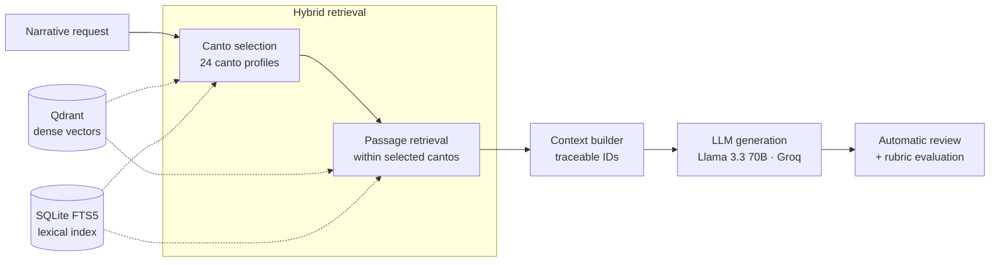

# Auditable Hybrid RAG · *The Odyssey*

**Hierarchical hybrid retrieval (dense + lexical, RRF) over Qdrant for controlled, traceable text generation.**
Master's thesis in Artificial Intelligence · UDIT · 2026 · Grade 8.5/10 · [Featured by UDIT ↗](https://www.udit.es/puede-una-inteligencia-artificial-introducir-nuevos-personajes-en-la-odisea-sin-traicionar-a-homero/)


> 🇪🇸 **Resumen:** sistema RAG auditable que recupera pasajes de *La Odisea* con búsqueda híbrida jerárquica (canto → fragmento) sobre Qdrant, para generar nuevos personajes sin romper la coherencia de la obra. Validación estadística sobre 108 historias generadas.

---

## The problem

LLMs write fluent text but have no controlled access to a source, so they can contradict it. The goal: **introduce new characters into a classic work without altering its events, relationships, chronology or ending**, and make every generation **traceable** to the passages it was grounded on.

## Architecture



| Component | Choice |
|---|---|
| Corpus | Spanish edition of *The Odyssey* · 24 cantos · **388 retrievable passages** with provenance metadata |
| Embeddings | `paraphrase-multilingual-MiniLM-L12-v2` via **FastEmbed** · 384-d · cosine |
| Vector DB | **Qdrant** (Docker or local mode) |
| Lexical search | SQLite **FTS5** |
| Fusion | Weighted **Reciprocal Rank Fusion** (passages: 0.25 dense / 0.75 lexical · cantos: 0.35 / 0.65) |
| Retrieval strategy | **Hierarchical**: top-5 cantos → 3 passages per canto → top-8 |
| Generator | Llama 3.3 70B through the Groq API |

## Results

**Retrieval** — evaluated on two separate sets of 24 control queries.

*Development set* (used to tune the weights and design the hierarchy):

| Strategy | Hit@1 | Hit@3 | Hit@5 | MRR |
|---|---:|---:|---:|---:|
| Dense only | 0.375 | 0.583 | 0.625 | 0.501 |
| Lexical only | 0.625 | 0.875 | 0.917 | 0.738 |
| Flat hybrid (RRF) | 0.458 | 0.708 | 0.750 | 0.584 |
| **Hierarchical hybrid** | **0.750** | **0.958** | **1.000** | **0.858** |

*Independent validation set* (new queries, not used during tuning) — final hierarchical retriever:

| Strategy | Hit@1 | Hit@3 | Hit@5 | MRR |
|---|---:|---:|---:|---:|
| **Hierarchical hybrid (final)** | **1.000** | **1.000** | **1.000** | **1.000** |

Proper names and places carry a strong lexical signal in this corpus, which is why lexical weight dominates and why selecting the canto first removes most errors.

**Generation** — 108 stories (12 scenarios × 3 configurations × 3 seeds), scored with a homogeneous rubric (canon respect, character integration, temporal coherence, narrative quality):

- Friedman test over 36 complete blocks: χ² = 8.07, **p = 0.018**, Kendall's W = 0.11
- Wilcoxon with Holm correction: **RAG significantly outperforms the no-retrieval baseline (p = 0.027)**

**Honest limitation:** perfect retrieval on control queries does not mean full coverage in real multi-canto scenarios — mean recall of target cantos during generation was **0.679**. Retrieval improves contextual traceability; narrative fidelity still needs explicit constraints and separate evaluation.

## What's in this repository

This is a **showcase** of the retrieval layer:

```
src/
  embedding_backends.py     FastEmbed backend (+ offline hashing backend for tests)
  qdrant_index.py           Passage indexing in Qdrant
  qdrant_index_cantos.py    Canto-profile indexing
  retriever.py              Flat hybrid retriever (dense + FTS5 + RRF)
  hierarchical_retriever.py Canto → passage hierarchical retriever
  benchmark_*.py            Hit@k / MRR evaluation
config/                     Retrieval configurations used in the experiments
results/                    Retrieval metrics (ablation + final validation)
docker-compose.yml          Qdrant service
```

The corpus, scenario sheets, prompts, evaluation rubric and generated stories are part of the thesis and are **not published**.

## Tech stack

Python · Qdrant · FastEmbed · SQLite FTS5 · NumPy · pandas · Docker · Groq API · non-parametric statistics (Friedman, Wilcoxon-Holm)

---

**María Tocado Murillo** · Applied AI & Data Scientist · [LinkedIn](https://www.linkedin.com/in/mar%C3%ADa-tocado-murillo/)

© 2026 María Tocado Murillo. All rights reserved — see [LICENSE](LICENSE).
